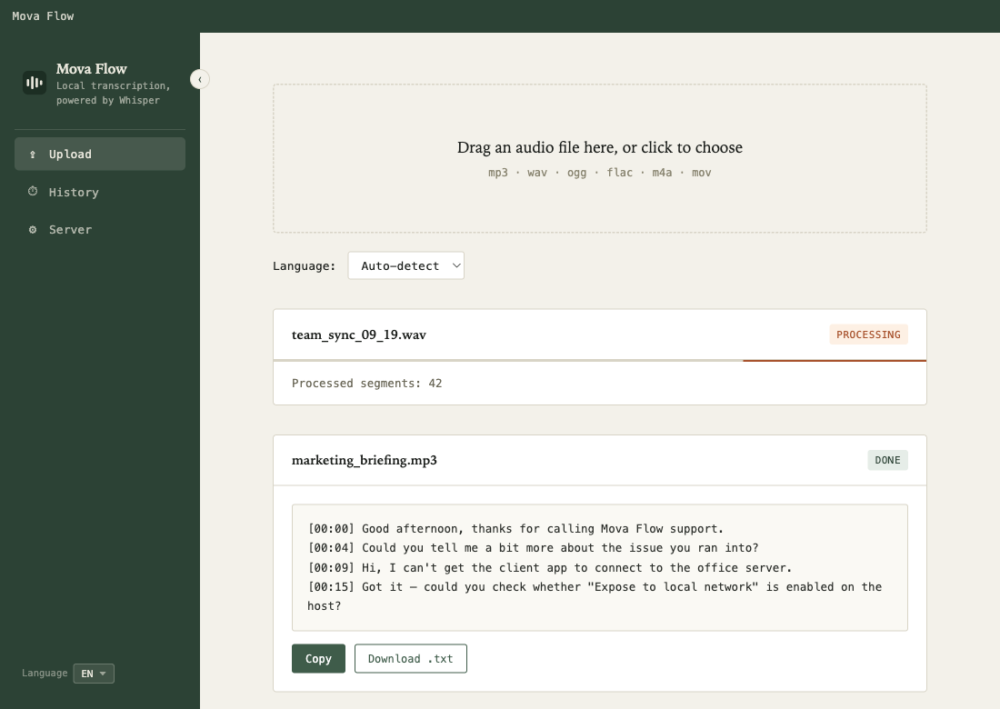
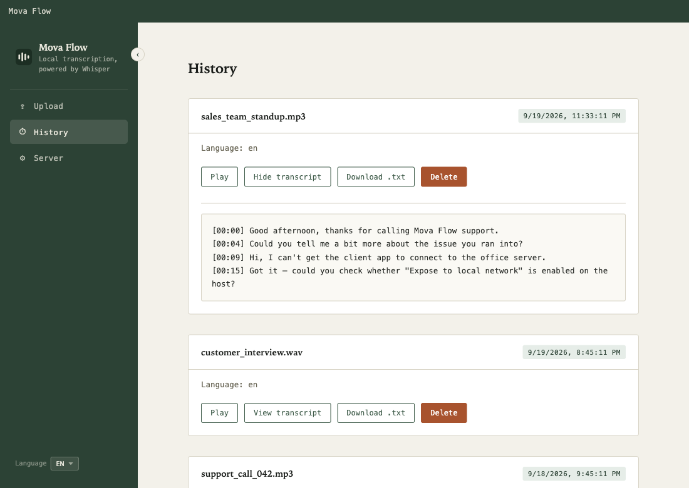
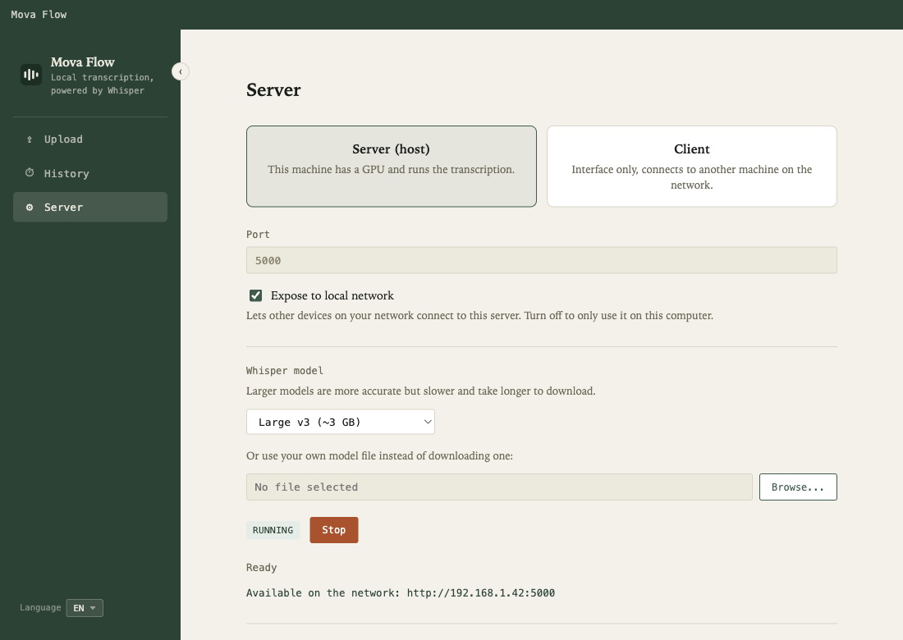
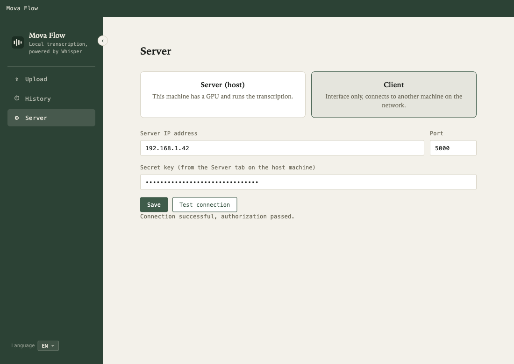

# Mova Flow

[](https://github.com/f3an/Mova-Flow/actions/workflows/ci.yml)
[](https://github.com/f3an/Mova-Flow/releases/latest)
[](LICENSE)

A local audio transcription app built on [whisper.cpp](https://github.com/ggml-org/whisper.cpp) — no Python, no cloud, recordings never leave your network. An Electron app for Windows: one machine with a GPU does the recognition, any number of other devices on the local network use it as clients.

**[f3an.github.io/Mova-Flow →](https://f3an.github.io/Mova-Flow/)**



## Contents

- [Download](#download)
- [Features](#features)
- [How it's built](#how-its-built)
- [Quick start](#quick-start)
- [Screenshots](#screenshots)
- [Project structure](#project-structure)
- [Development](#development)
- [Security](#security)
- [Documentation](#documentation)
- [License](#license)

## Download

Grab the latest build from **[github.com/f3an/Mova-Flow/releases/latest](https://github.com/f3an/Mova-Flow/releases/latest)**:

| Platform | Asset | What you get |
|---|---|---|
| Windows | `Mova-Flow-Setup-<version>.exe` | Full app — server (host) and client roles |
| macOS | `Mova-Flow-<version>.dmg` | Client role only — no local recognition, see [Platform constraints](docs/ARCHITECTURE.md#platform-constraints) |
| Any OS | Source code (`.zip`/`.tar.gz`, auto-attached by GitHub to every release) | Build it yourself, see [Development](#development) |

Installers aren't code-signed, so:

- **Windows** may show a SmartScreen warning — click "More info" → "Run anyway".
- **macOS** will refuse to open the app at all ("is damaged and can't be opened") — this is Gatekeeper reacting to an unsigned app downloaded from a browser, not actual corruption. The `.dmg` includes an **"Install & Open.command"** file — double-click it and it installs to `/Applications`, clears the quarantine flag, and launches the app in one step. (The command-line equivalent, if you'd rather: `xattr -cr "/Applications/Mova Flow.app"`.)

Every tagged release is built automatically by [`.github/workflows/release.yml`](.github/workflows/release.yml).

## Features

- **Local speech recognition** via `whisper-cli.exe` (whisper.cpp) — no audio data ever leaves your network.
- **Server / client roles**: one machine (usually with a GPU) holds the model and does the transcription; other devices connect to it over the network as thin clients.
- **Automatic GPU detection**: checks for an NVIDIA GPU via `nvidia-smi`, then downloads the matching CUDA or CPU build of whisper.cpp automatically.
- **Whisper model choice**: anything from `tiny` (~75 MB) to `large-v3` (~3 GB), or your own `.bin` file.
- **Format support**: `.mp3 .wav .ogg .flac` sent as-is; `.m4a` and `.mov` are converted to WAV right in the browser (Web Audio API), with no external binaries.
- **Transcription history**: kept alongside the original audio on the host; kept separately and locally on the client, and never reaches the host at all (see [docs/ARCHITECTURE.md](docs/ARCHITECTURE.md#security-model)).
- **Access protection**: a shared secret key plus short-lived bearer tokens (HS256, 12h TTL) on every API request.
- **English and Ukrainian UI**, switchable on the fly.
- **Runs quietly in the tray**: closing the window hides it instead of quitting, so the host keeps serving — right-click the tray icon (menu bar on macOS) → **Exit** to actually shut it down.
- **Checks for updates on its own**: Windows/Linux download and install with one click; macOS (unsigned, so it can't self-install) just shows a banner linking to the latest release.
- **Finds the host on the network for you**: a "Scan network" button on the client role uses mDNS to list available hosts — no need to type an IP, though you still can.

## How it's built

An Electron app with the usual three layers (renderer ↔ preload ↔ main) plus a built-in HTTP API (Express) so clients can talk to the host over the network:


The host and a client exchange data over a small REST API, protected by a shared secret and a short-lived token:


See [docs/ARCHITECTURE.md](docs/ARCHITECTURE.md) for the full picture, including the complete file pipeline from drop to saved transcript.

## Quick start

> The **server** role (recognition) only runs on **Windows** — `engine.ts` relies on `whisper-cli.exe`, PowerShell's `Expand-Archive`, and `nvidia-smi`. The **client** role is UI-only, so it runs on any OS Electron supports.

### Server (the machine with a GPU, or a strong CPU)

1. Install and launch Mova Flow, pick **"Server (host)"** on the Server tab.
2. Choose a Whisper model (`large-v3` by default) or point it at your own `.bin` file.
3. If needed, turn on **"Expose to local network"** so other devices can connect.
4. Press **"Start"** — on first launch the app downloads the whisper.cpp binary (the CUDA build if a GPU is present) and the chosen model on its own.
5. Copy the **"Access secret key"** — every client will need it.

### Client (any other device on the network)

1. Pick **"Client"**.
2. Enter the host's IP address and port (`5000` by default), paste in the secret key.
3. Press **"Test connection"**, then **"Save"**.
4. Go to the **"Upload"** tab and drop in an audio file.

## Screenshots

| Upload | History |
|---|---|
|  |  |

| Server — host role | Server — client role |
|---|---|
|  |  |

## Project structure

```
src/
  main/
    index.ts          Electron window, config.json, every ipcMain.handle
    server.ts          Express server: /api/*, ServerController (start/stop)
    engine.ts          downloads whisper.cpp + the model, spawns whisper-cli.exe
    auth.ts             secret, HS256 tokens, timing-safe comparison
    clientHistory.ts   the client's own local history (separate from the host's)
    download.ts         HTTPS file download, following redirects by hand
    rateLimit.ts         a minimal in-memory rate limiter
  preload/
    index.ts             contextBridge: window.api, window.platform
  renderer/
    index.html, style.css, renderer.ts, i18n.ts   the UI (3 tabs)
docs/
  ARCHITECTURE.md         in-depth technical write-up
  API.md                  HTTP API reference
  diagrams/                architecture diagrams (SVG)
  screenshots/             UI screenshots
```

## Development

```bash
npm install
npm run typecheck     # tsc --noEmit
npm run build          # main (tsc) + renderer (esbuild)
npm run dev             # build + electron .
npm run dist             # build + electron-builder (release/)
```

`npm run dev` works fine on macOS/Linux for UI work (tabs, i18n, the client role) — the host role only actually recognizes audio on Windows.

## Security

- `/api/transcribe`, `/api/status`, and `/api/download` all require a bearer token, issued in exchange for the shared secret (`POST /api/auth`), checked with a timing-safe comparison and a 12-hour TTL.
- History endpoints (`/api/history*`) are further restricted by a `requireLocal` check — reachable only from `127.0.0.1`, even with a valid token. That means a client's history can never physically end up on the host.
- The server only binds to `0.0.0.0` when "Expose to local network" is explicitly turned on; by default it's `127.0.0.1` only.

See [docs/ARCHITECTURE.md](docs/ARCHITECTURE.md) for the full threat model and data flow.

## Documentation

- [docs/ARCHITECTURE.md](docs/ARCHITECTURE.md) — Electron processes, the transcription pipeline, the security model, on-disk file layout.
- [docs/API.md](docs/API.md) — full HTTP API reference with example requests and responses.
- [CONTRIBUTING.md](CONTRIBUTING.md) — dev setup, code style, PR checklist.
- [SECURITY.md](SECURITY.md) — how to report a vulnerability.

## License

[Apache License 2.0](LICENSE).
