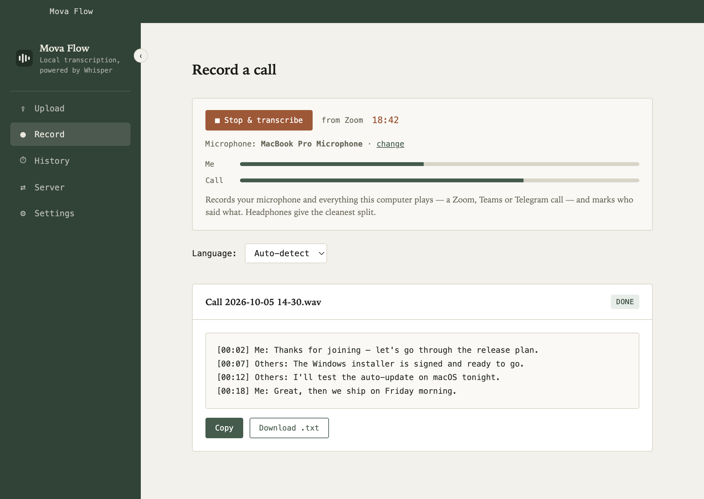
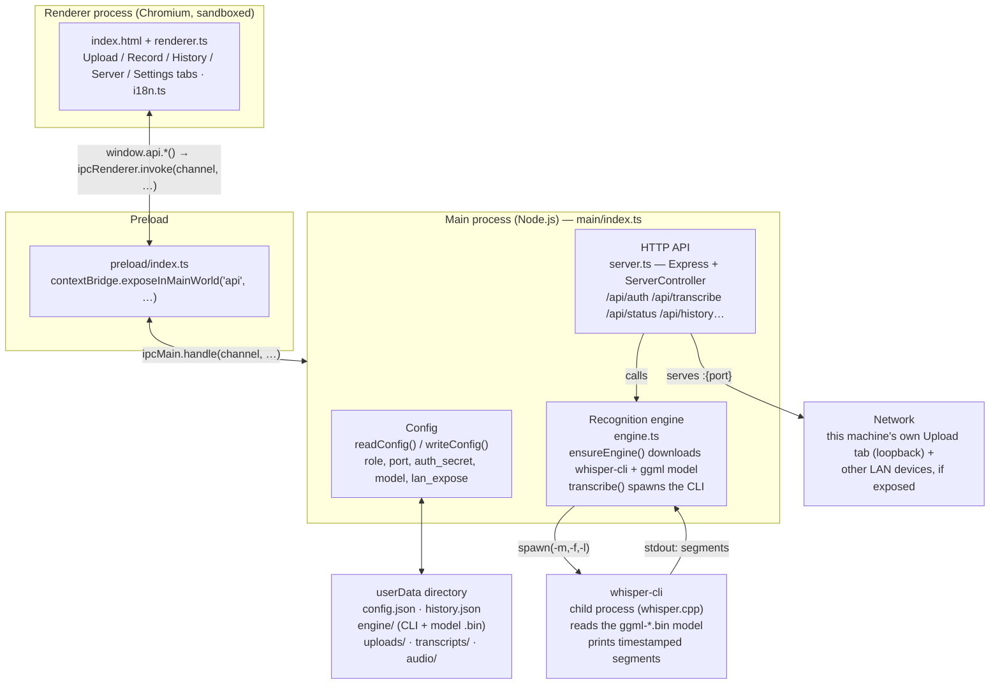
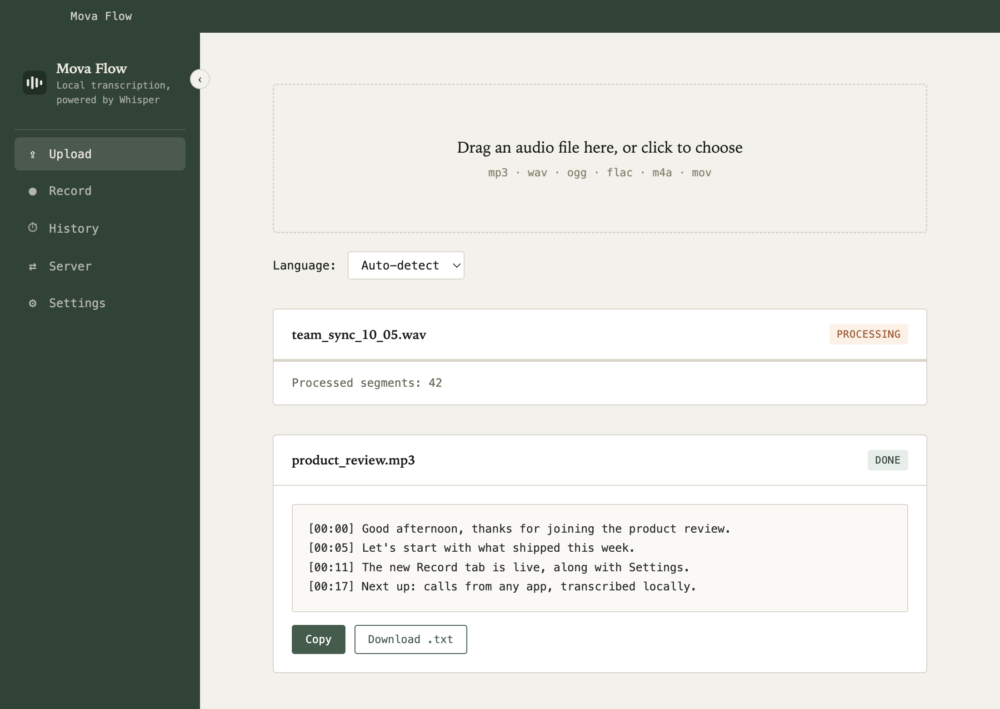
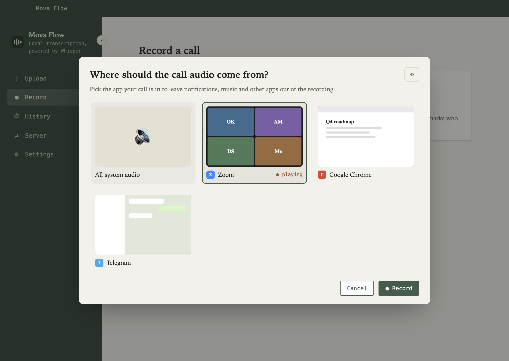
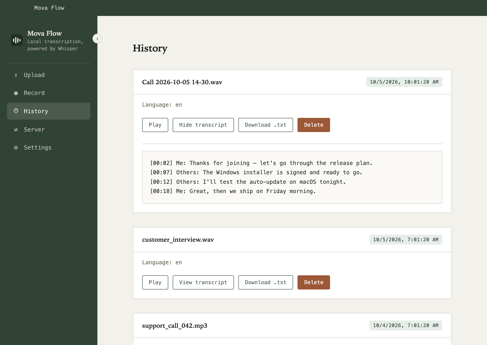
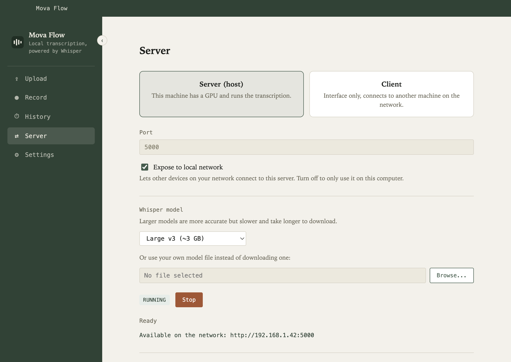
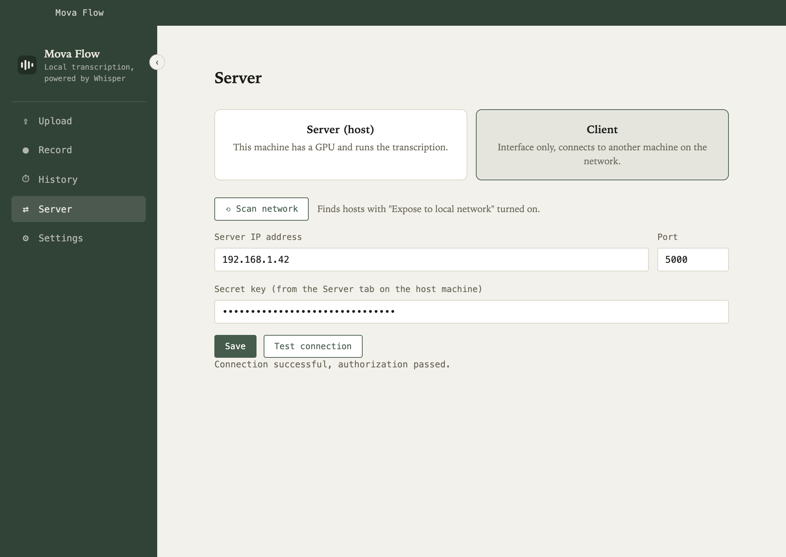
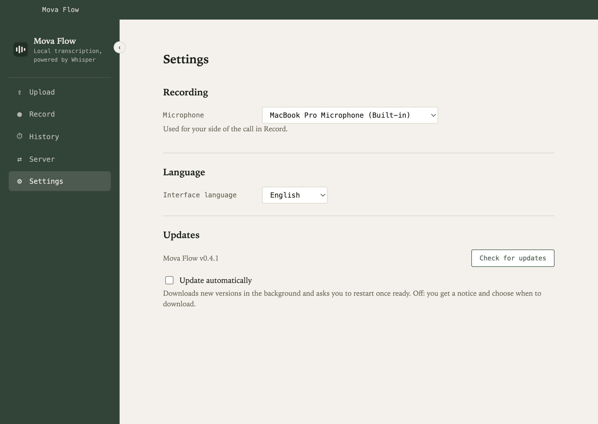

# Mova Flow

[](https://github.com/f3an/Mova-Flow/actions/workflows/ci.yml)
[](https://github.com/f3an/Mova-Flow/releases/latest)
[](LICENSE)

A local audio transcription app built on [whisper.cpp](https://github.com/ggml-org/whisper.cpp) — no Python, no cloud, recordings never leave your network. An Electron app for Windows and macOS: one machine with a GPU does the recognition, any number of other devices on the local network use it as clients. Transcribe files, or record a call from any app and get a transcript that says who said what.

**[f3an.github.io/Mova-Flow →](https://f3an.github.io/Mova-Flow/)**



## Contents

- [Download](#download)
- [Features](#features)
- [How it's built](#how-its-built)
- [Quick start](#quick-start)
- [Browser extension](#browser-extension)
- [Screenshots](#screenshots)
- [Project structure](#project-structure)
- [Development](#development)
- [Security](#security)
- [Documentation](#documentation)
- [License](#license)

## Download

Grab the latest build from **[github.com/f3an/Mova-Flow/releases/latest](https://github.com/f3an/Mova-Flow/releases/latest)**:

| Platform | Asset | What you get |
|---|---|---|
| Windows | `Mova-Flow-Setup-<version>.exe` | Full app — server (host) and client roles |
| macOS | `Mova-Flow-<version>.dmg` | Full app on Apple Silicon (server + client); Intel Macs get the client role only — see [Platform constraints](docs/ARCHITECTURE.md#platform-constraints) |
| Any OS | Source code (`.zip`/`.tar.gz`, auto-attached by GitHub to every release) | Build it yourself, see [Development](#development) |

The macOS build is signed and notarized, so it opens normally. The Windows installer isn't code-signed yet, so it may show a SmartScreen warning — click "More info" → "Run anyway".

Every tagged release is built automatically by [`.github/workflows/release.yml`](.github/workflows/release.yml).

## Features

- **Local speech recognition** via `whisper-cli` (whisper.cpp) — no audio data ever leaves your network. Silence is skipped with a small voice-activity model, so a quiet stretch can't turn into a hallucinated line repeated over the whole file.
- **Record a call from any app** (Zoom, Teams, Telegram, a browser…) on the **Record** tab: your microphone and everything the computer plays go on separate channels, each is transcribed on its own, and every line is marked **Me** or **Others** — overlapping speech keeps both sides. On macOS you can pick the one app to record from a picker with window thumbnails, so notifications and music stay out. Start and stop from the tab, the tray or the Dock; a badge / taskbar overlay shows a call is being recorded.
- **Server / client roles**: one machine (usually with a GPU) holds the model and does the transcription; other devices connect to it over the network as thin clients.
- **Automatic engine setup**: downloads the right whisper.cpp build on first run — on Windows it checks for an NVIDIA GPU via `nvidia-smi` and picks CUDA or CPU accordingly; on Apple Silicon it uses a Metal-accelerated build.
- **Whisper model choice**: anything from `tiny` (~75 MB) to `large-v3` (~3 GB), or your own `.bin` file.
- **Format support**: `.mp3 .wav .ogg .flac` sent as-is; `.m4a` and `.mov` are converted to WAV right in the browser (Web Audio API), with no external binaries.
- **Transcription history**: kept alongside the original audio on the host; kept separately and locally on the client, and never reaches the host at all (see [docs/ARCHITECTURE.md](docs/ARCHITECTURE.md#security-model)).
- **Access protection**: a shared secret key plus short-lived bearer tokens (HS256, 12h TTL) on every API request.
- **Settings tab**: the microphone used for recordings (with a warning for Bluetooth headsets, which drop to headset mode), the interface language (English / Ukrainian) and updates.
- **Runs quietly in the tray**: closing the window hides it instead of quitting, so the host keeps serving — the tray icon (menu bar on macOS) has **Record a call** and **Exit**.
- **Updates on your terms**: you're told when a new version is out and choose when to download it, with progress, then restart — or turn on automatic updates. Engine downloads (whisper.cpp builds, Whisper and VAD models) are mirrored in GitHub Packages with the upstream sources as a fallback, checksum-verified.
- **Finds the host on the network for you**: a "Scan network" button on the client role uses mDNS to list available hosts — no need to type an IP, though you still can.
- **Companion Chrome extension** for recording Google Meet calls straight into your Mova Flow host — see [Browser extension](#browser-extension).

## How it's built

An Electron app with the usual three layers (renderer ↔ preload ↔ main) plus a built-in HTTP API (Express) so clients can talk to the host over the network:


```mermaid
flowchart TB
    subgraph UI["Renderer process (Chromium, sandboxed)"]
        R["index.html + renderer.ts<br/>Upload / Record / History / Server / Settings tabs · i18n.ts"]
    end

    subgraph PL["Preload"]
        P["preload/index.ts<br/>contextBridge.exposeInMainWorld('api', …)"]
    end

    subgraph MAIN["Main process (Node.js) — main/index.ts"]
        C["Config<br/>readConfig() / writeConfig()<br/>role, port, auth_secret, model, lan_expose"]
        H["HTTP API<br/>server.ts — Express + ServerController<br/>/api/auth /api/transcribe /api/status /api/history…"]
        E["Recognition engine<br/>engine.ts<br/>ensureEngine() downloads whisper-cli + ggml model<br/>transcribe() spawns the CLI"]
    end

    FS["userData directory<br/>config.json · history.json<br/>engine/ (CLI + model .bin)<br/>uploads/ · transcripts/ · audio/"]
    NET["Network<br/>this machine's own Upload tab (loopback) +<br/>other LAN devices, if exposed"]
    CLI["whisper-cli<br/>child process (whisper.cpp)<br/>reads the ggml-*.bin model<br/>prints timestamped segments"]

    R <-->|"window.api.*() → ipcRenderer.invoke(channel, …)"| P
    P <-->|"ipcMain.handle(channel, …)"| MAIN
    H -->|calls| E
    C <--> FS
    H -->|"serves :{port}"| NET
    E -->|"spawn(-m,-f,-l)"| CLI
    CLI -->|"stdout: segments"| E
```

The host and a client exchange data over a small REST API, protected by a shared secret and a short-lived token:

```mermaid
sequenceDiagram
    participant Client as Client machine<br/>(role: client — UI only)
    participant Host as Host machine<br/>(role: host — server.ts on :5000)

    Client->>Host: ① POST /api/auth { secret }
    Note over Client,Host: secret copied once from the host's Server tab → Access secret key
    Host-->>Client: ② 200 { token, expiresAt }
    Note over Host,Client: HS256 token, timingSafeEqual check, 12h TTL

    Client->>Host: ③ POST /api/transcribe<br/>Authorization: Bearer &lt;token&gt;, multipart audio file
    activate Host
    Note right of Host: ④ rateLimiter → requireAuth → multer<br/>saves to uploads/, then spawns whisper-cli
    Host-->>Client: ⑤ 200 { job_id }
    deactivate Host

    loop every 1.5s until status is "done" or "error"
        Client->>Host: ⑥ GET /api/status/:job_id
        Host-->>Client: { status } → … → { status: "done", result }
    end

    Client->>Host: ⑦ GET /api/download/:job_id
    Host-->>Client: ⑧ 200 transcript_&lt;id&gt;.txt

    Note over Host: requireLocal — /api/history*<br/>any request whose IP isn't 127.0.0.1 gets 403,<br/>even with a valid token
```

See [docs/ARCHITECTURE.md](docs/ARCHITECTURE.md) for the full picture, including the complete file pipeline from drop to saved transcript.

## Quick start

> The **server (host)** role runs on **Windows** and **Apple Silicon macOS** — see [Platform constraints](docs/ARCHITECTURE.md#platform-constraints) for how each fetches its `whisper-cli` build. The **client** role is UI-only, so it runs on any OS Electron supports.

### Server (the machine with a GPU, or a strong CPU)

1. Install and launch Mova Flow, pick **"Server (host)"** on the Server tab.
2. Choose a Whisper model (`large-v3` by default) or point it at your own `.bin` file.
3. If needed, turn on **"Expose to local network"** so other devices can connect.
4. Press **"Start"** — on first launch the app downloads the whisper.cpp binary (the CUDA build if a GPU is present) and the chosen model on its own.
5. Copy the **"Access secret key"** — every client will need it.

### Client (any other device on the network)

1. Pick **"Client"**.
2. Enter the host's IP address and port (`5000` by default), paste in the secret key.
3. Press **"Test connection"**, then **"Save"**.
4. Go to the **"Upload"** tab and drop in an audio file.

### Recording a call

1. Join the call in any app — headphones give the cleanest split between you and the others.
2. Open the **Record** tab (or the tray / Dock menu) and press **● Record a call**. On macOS, pick the app the call is in, or "All system audio".
3. Press **■ Stop & transcribe** when the call ends. The transcript comes back with each line marked **Me** or **Others** and lands in History.

The first recording asks for the microphone and, on macOS, for **System Audio Recording** (plus Screen Recording, only for the picker's window thumbnails — recording works without it). Choose which microphone records you in **Settings → Recording**.

## Browser extension

[**Mova Flow Meet Recorder**](https://chromewebstore.google.com/detail/mova-flow-meet-recorder/kdeeohghjiengnkgfpjkakeajhnddfnh) is a companion Chrome extension that records a Google Meet call — both sides of the conversation, not just what you hear — and sends it to your Mova Flow host for transcription over the same shared-secret/bearer-token flow the desktop app uses.

- Adds a **Record** button right into Meet's own call-controls toolbar, or use the same button from the extension's popup.
- Records everyone else from the tab, and your own side from the audio Meet itself sends — no microphone permission needed, and silent while you're muted. The two sides stay on separate channels, so the transcript marks who said what (`Me:` / names from Meet's captions).
- If the host can't be reached, the recording is saved to Downloads as a `.wav` instead — upload it manually once the host is back.

**[Get it on the Chrome Web Store →](https://chromewebstore.google.com/detail/mova-flow-meet-recorder/kdeeohghjiengnkgfpjkakeajhnddfnh)** — or build it yourself from [source](https://github.com/f3an/mova-flow-meet-recorder). See the [privacy policy](https://f3an.github.io/Mova-Flow/privacy.html) for what data it handles.

## Screenshots

| Upload | Record a call |
|---|---|
|  |  |

| Choosing what to record (macOS) | History |
|---|---|
|  |  |

| Server — host role | Server — client role |
|---|---|
|  |  |

| Settings | |
|---|---|
|  | |

## Project structure

```
src/
  main/
    index.ts          Electron window, tray/Dock menus, config.json, every ipcMain.handle
    server.ts          Express server: /api/*, ServerController (start/stop)
    engine.ts          downloads whisper.cpp + models, spawns whisper-cli (per channel for calls)
    speakerNames.ts    Meet caption names → speakers in the transcript
    systemAudio.ts     "Record a call": system audio (Windows loopback / macOS helper)
    discovery.ts       mDNS host advertising and network scan
    lanAddress.ts      picks the real LAN adapter (skips WSL/Hyper-V/VPN)
    ghcr.ts             downloads from the GitHub Packages mirrors, sha256-checked
    auth.ts             secret, HS256 tokens, timing-safe comparison
    clientHistory.ts   the client's own local history (separate from the host's)
    download.ts         HTTPS file download, following redirects by hand
    rateLimit.ts         a minimal in-memory rate limiter
  preload/
    index.ts             contextBridge: window.api, window.platform
  renderer/
    index.html, style.css, renderer.ts, i18n.ts   the UI (5 tabs)
    callRecorder.ts      mic + system audio → aligned stereo WAV
    sourcePicker.ts      "what to record" modal with window thumbnails
native/macos/audio-tap/   Swift helper: Core Audio process tap, app list, window thumbnails
docs/
  ARCHITECTURE.md         in-depth technical write-up (diagrams are inline Mermaid)
  API.md                  HTTP API reference
  screenshots/             UI screenshots
```

## Development

```bash
npm install
npm run typecheck     # main/preload (tsconfig.json) + renderer (tsconfig.renderer.json)
npm run build          # main (tsc) + renderer (esbuild)
npm run build:native   # macOS only: the Swift audio-tap helper → build/bin
npm run dev             # build + electron .
npm run dist             # build + build:native + electron-builder (release/)
```

The host role recognizes audio on Windows and Apple Silicon macOS; on Linux, `npm run dev` is fine for UI work and the client role. Recording a call on macOS needs `npm run build:native` once (Xcode command-line tools).

## Security

- `/api/transcribe`, `/api/status`, and `/api/download` all require a bearer token, issued in exchange for the shared secret (`POST /api/auth`), checked with a timing-safe comparison and a 12-hour TTL.
- History endpoints (`/api/history*`) are further restricted by a `requireLocal` check — reachable only from `127.0.0.1`, even with a valid token. That means a client's history can never physically end up on the host.
- The server only binds to `0.0.0.0` when "Expose to local network" is explicitly turned on; by default it's `127.0.0.1` only. Even then, connections from outside private address ranges (a public IP, a port forward) are dropped before they reach the API.

See [docs/ARCHITECTURE.md](docs/ARCHITECTURE.md) for the full threat model and data flow.

## Documentation

- [docs/ARCHITECTURE.md](docs/ARCHITECTURE.md) — Electron processes, the transcription pipeline, the security model, on-disk file layout.
- [docs/API.md](docs/API.md) — full HTTP API reference with example requests and responses.
- [CONTRIBUTING.md](CONTRIBUTING.md) — dev setup, code style, PR checklist.
- [SECURITY.md](SECURITY.md) — how to report a vulnerability.

## License

[Apache License 2.0](LICENSE).
