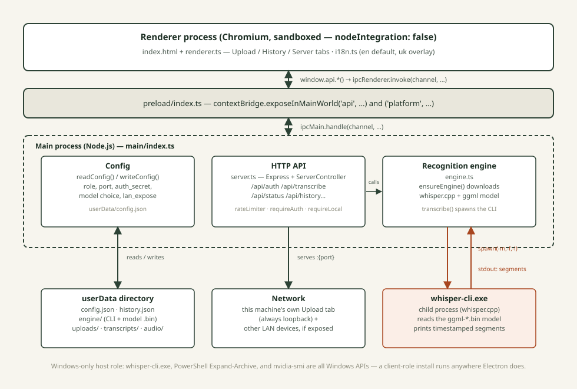
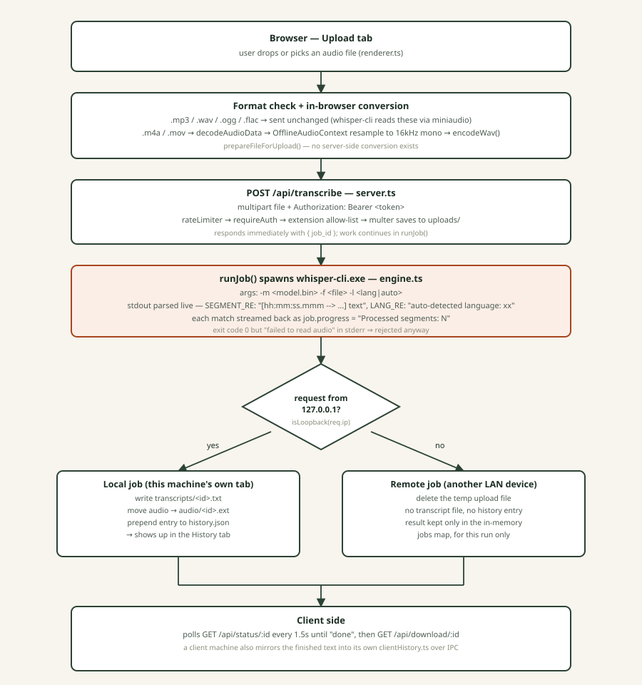
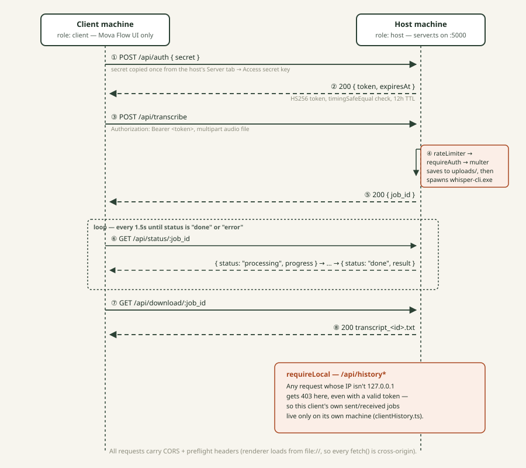

# Mova Flow architecture

This document covers the app's internals: the Electron process model, the audio transcription pipeline, the security model, and the on-disk data layout. For a general overview and quick start, see [README.md](../README.md).

## Contents

- [Electron processes](#electron-processes)
- [Transcription pipeline](#transcription-pipeline)
- [Security model](#security-model)
- [On-disk data](#on-disk-data)
- [Audio formats](#audio-formats)
- [Platform constraints](#platform-constraints)

## Electron processes

The app is the usual three Electron layers plus a built-in HTTP server, which is what makes the "one server, many clients" setup possible over the network:



- **Renderer** (`src/renderer/`) — an ordinary sandboxed Chromium page (`nodeIntegration: false`, `contextIsolation: true`). No direct access to Node.js or the filesystem; everything goes through `window.api`.
- **Preload** (`src/preload/index.ts`) — the only bridge between the renderer and the main process. Via `contextBridge.exposeInMainWorld` it publishes an `api` object (thin wrappers around `ipcRenderer.invoke`) and a `platform` string (only needed for the CSS padding under macOS's traffic-light buttons).
- **Main** (`src/main/index.ts`) — owns the window, `config.json`, every `ipcMain.handle` handler, and starts/stops the HTTP server (`ServerController` in `server.ts`).
- **HTTP API** (`src/main/server.ts`) — an Express server listening on `127.0.0.1` (or `0.0.0.0` once "Expose to local network" is turned on) that serves both the host's own Upload tab (always over loopback) and requests from client machines on the network.
- **Recognition engine** (`src/main/engine.ts`) — downloads the whisper.cpp binary and the model, and spawns `whisper-cli.exe` as a child process for each job.

The renderer never talks to `whisper-cli.exe` or the filesystem directly — every command travels `renderer → preload (IPC) → main → HTTP API → engine → child process`.

## Transcription pipeline

The path from a dropped file to a finished history entry:



Key details:

1. **Conversion happens in the browser, not on the server.** `whisper-cli.exe` can only read `.mp3 .wav .ogg .flac` (the formats its bundled `miniaudio` supports). `.m4a`/`.mov` files are converted to 16kHz mono WAV right in the renderer via `decodeAudioData` → `OfflineAudioContext` → a hand-written 44-byte WAV header (`encodeWav()` in `renderer.ts`). The server has no converter of its own.
2. **Progress streams without websockets.** `whisper-cli.exe` writes segments to stdout as it recognizes them. `engine.ts` parses each line with regular expressions (`SEGMENT_RE`, `LANG_RE`) and updates `job.progress` in memory; the client polls `GET /api/status/:id` every 1.5s.
3. **Local job vs. a job from the network.** `server.ts` tells the two apart with `isLoopback(req.ip)`. If the request came from the host itself (the host's own Upload tab always goes through `127.0.0.1`), the result is saved to `history.json`, the audio is moved into `audio/`, and the text is written to `transcripts/`. If the request came from another machine on the network, the temp file is deleted, no host-side history entry is created, and the text lives only in memory (the `jobs` map) for as long as the server process runs.
4. **The client keeps its own history.** Since the host remembers nothing about network jobs, a client-role Mova Flow saves the audio + text locally itself, through `clientHistory.ts` (IPC, not HTTP), once the result comes back — so the History tab still works on the client side.

## Security model



- **A shared secret, not a user password.** The host generates an `auth_secret` (24 random bytes, base64url) on first launch and shows it on the Server tab. Every client enters that same string once, when setting up the connection.
- **Short-lived bearer tokens.** `POST /api/auth` exchanges the secret for an HS256 token (`auth.ts`, a minimal hand-rolled implementation with no external library) with a 12-hour TTL. Every subsequent request (`/api/transcribe`, `/api/status/:id`, `/api/download/:id`) requires an `Authorization: Bearer <token>` header, checked by `requireAuth`.
- **Timing-safe comparisons.** Both the secret check and the token signature check go through `timingSafeEqualStr` (`crypto.timingSafeEqual` with a length pre-check) so the secret can't be recovered via a timing attack.
- **History is loopback-only, regardless of the token.** `requireLocal` in `server.ts` returns `403` for any request whose IP isn't `127.0.0.1`/`::1` — even with a valid bearer token. That means the host's history is physically unreachable from the network, by anyone but the host itself.
- **In-memory rate limiting.** A simple fixed-window counter (`rateLimit.ts`), with a stricter limit specifically on `/api/auth` (5 attempts/minute per IP) to slow down secret brute-forcing.
- **Network exposure is opt-in.** The server binds to `127.0.0.1` by default; binding to `0.0.0.0` (and thus being reachable on the LAN) only happens when "Expose to local network" is explicitly turned on, on the Server tab.

## On-disk data

Everything lives under `app.getPath('userData')` (the OS's per-user app profile), never next to the app itself:

```
userData/
  config.json               role, host/port, secrets, chosen model, lan_expose
  engine/
    bin/Release/whisper-cli.exe   the whisper.cpp binary (downloaded once)
    ggml-<preset>.bin              the chosen model (or the user's own file)
  uploads/                   temp files while a job is being processed (multer)
  transcripts/<id>.txt        finished transcripts — host's local jobs only
  audio/<id><ext>              original audio — host's local jobs only
  history.json                the host's local job list (newest first)
  client-history.json          the client's own history (client role)
  client-audio/, client-transcripts/   the client history's audio and text
```

Record IDs are 12-character hex strings (`randomUUID().replace(/-/g,'').slice(0,12)`); every filesystem path built from a user-supplied ID is checked against `^[a-f0-9]{1,32}$` before it's used.

## Audio formats

| Extension | Handling |
|---|---|
| `.mp3 .wav .ogg .flac` | sent unchanged — `whisper-cli.exe` reads these directly via `miniaudio` |
| `.m4a .mov` | re-encoded in the browser to 16kHz mono WAV before upload (`prepareFileForUpload()`) |
| anything else | rejected by the server (`400 Unsupported format`) before `whisper-cli.exe` ever runs |

## Platform constraints

The **"Server (host)"** role is tied to Windows at the code level:

- `whisper-cli.exe` is a precompiled whisper.cpp build for Windows only (CUDA or CPU variant, depending on `nvidia-smi`).
- Archive extraction goes through `powershell.exe Expand-Archive`, deliberately, instead of the npm package `extract-zip`, which has an unpatched symlink vulnerability.
- GPU detection goes through `nvidia-smi`, which ships with the NVIDIA driver, with no need for the CUDA Toolkit.

The **"Client"** role is a plain UI with no dependency on any of that, so it runs on any OS Electron supports (verified with an `npm run dist` build on macOS, for UI development).
